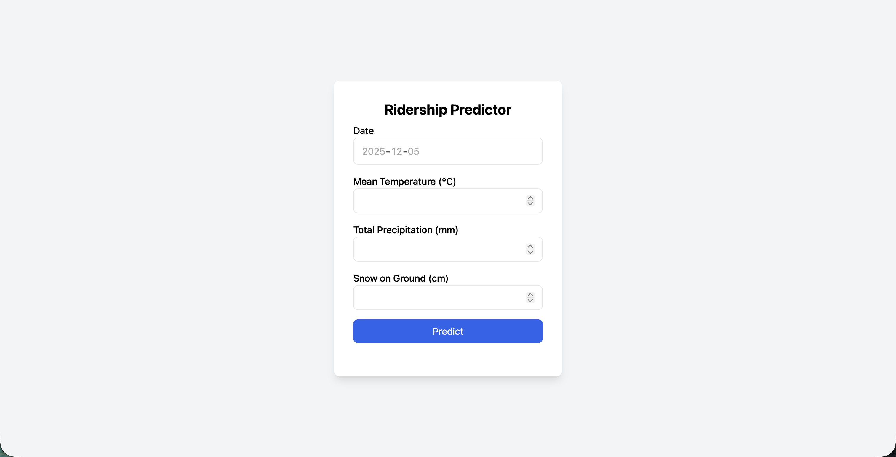
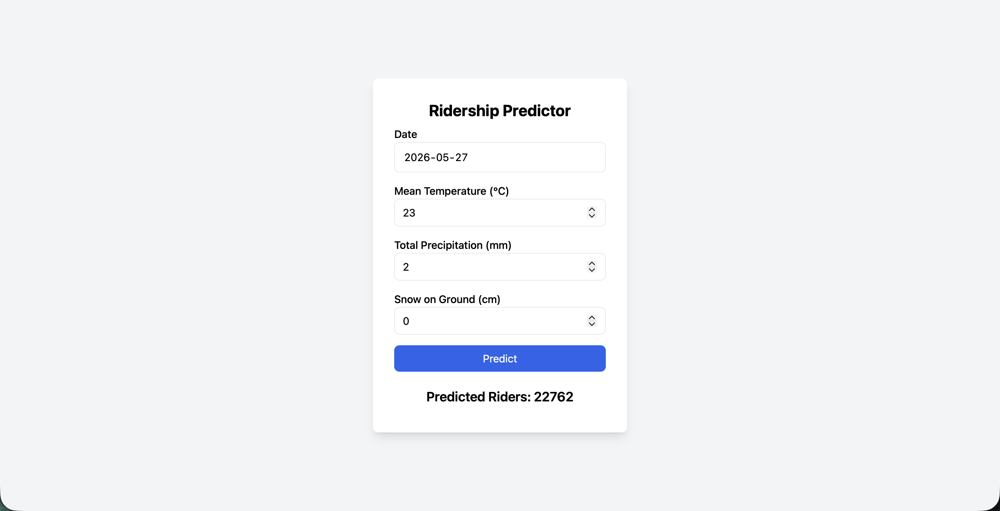

# Machine Learning Final Project

## 1. Problem
Predict daily ridership for Toronto’s Bike Share program using weather and calendar signals.

## 2. Why we want to solve it
Better forecasts would assist city planners in many things, such as deciding how many bikes they need to buy, how many bike mechanics are needed etc. 

## 3. How we did this
- We gathered historic ridership and weather (January 2022-September 2024), cleaned them into a single daily table, and trained an MLP to predict total riders.

#### 3a. Datasets (sources)
- Ridership: https://open.toronto.ca/dataset/bike-share-toronto-ridership-data/
- Weather: https://climate.weather.gc.ca/climate_data/daily_data_e.html?hlyRange=2002-06-04%7C2025-11-04&dlyRange=2002-06-04%7C2025-11-04&mlyRange=2003-07-01%7C2006-12-01&StationID=31688&Prov=ON&urlExtension=_e.html&searchType=stnProx&optLimit=yearRange&Month=1&Day=1&StartYear=2020&EndYear=2025&Year=2024&selRowPerPage=25&Line=0&txtRadius=25&optProxType=city&selCity=43%7C39%7C79%7C23%7CToronto&selPark&txtCentralLatDeg&txtCentralLatMin=0&txtCentralLatSec=0&txtCentralLongDeg&txtCentralLongMin=0&txtCentralLongSec=0&txtLatDecDeg&txtLongDecDeg&timeframe=2&time=LST

#### 3b. Cleaning to `combined_cleaned.csv`
- In `CleaningDataset.ipynb`, daily ridership CSVs (2022–2024) are aggregated to total riders per day and merged with daily weather (mean temp, snow on ground, total precip).
- Added calendar fields: `month`, `day_of_week`, `is_weekend`.
- Added weather flags: `rain_flag`, `snow_flag`, `heat_flag`, `freeze_flag`.
- Missing weather values are filled with zeros; final dataset saved to `datasets/combined_cleaned.csv`.

#### 3c. Model creation (MLP)
- In `Machine Learning Model creation.ipynb`, we load `combined_cleaned.csv`, split train/test, and train a multilayer perceptron  on the engineered features.

## 4. MLP architecture
- Input: 10 features
    - temperature in C 
    - precipitation in mm 
    - snow on the ground in cm
    - month
    - day_of_week
    - is_weekend flag
    - rain_flag
    - snow_flag
    - heat_flag 
    - freeze_flag
- Hidden stack: 64 → 64 → 32 → 16 with ReLU activations.
- BatchNorm + Dropout for stability and regularization
- Adam optimizer
- MSE loss.

## 5. Website
- Flask app (`app.py` + `templates/index.html`) that renders a simple page styled with TailwindCSS where user enters date, temperature, precipitation, snow on ground, and posts to `/predict`, and returns predicted riders.
- Screenshots:

## 6. How to run the website
1. Ensure dependencies are installed (`pip install -r requirements.txt`).
2. Regenerate data with `CleaningDataset.ipynb`, retrain in `Machine Learning Model creation.ipynb`, and save `model.pth` (matches 10-feature MLP).
3. Start the app: `python app.py`.
4. Open the served URL (default http://127.0.0.1:5000) and submit date + weather values to get predictions.
